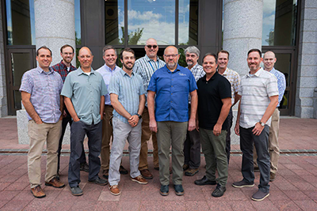

#### Quick Links

- [AGRC Mission]({{ "/about/mission/" | prepend: site.baseurl }})
- [GIS-related Utah Statute]({{ "/about/code" | prepend: site.baseurl }})
- [AGRC Contacts]({{ "/about/contact/" | prepend: site.baseurl }})
- [AGRC Directions and Parking]({{ "/about/visiting-agrc" | prepend: site.baseurl }})
- [Contributing to this website]({{ "/about/contributing" | prepend: site.baseurl }})
- [AGRC Policies]({{ "/policies" | prepend: site.baseurl }})
{: .dotless }

## Our Background
{: .text-left }

The Automated Geographic Reference Center (AGRC) is the State of Utah’s map technology coordination office. AGRC staff ([directory/contacts]({{ "/about/contact/" | prepend: site.baseurl }})) have knowledge and experience in geographic information system (GIS) desktop software, hosted map- and web-services, mapping data resources, and GIS professionals and their activities around the state.

We are located on the 5th floor of the State Office building, directly north of the Capitol [directions and parking]({{ "/about/visiting-agrc" | prepend: site.baseurl }}).  AGRC and the Utah CIO’s office compose the Integrated Technologies division within the Department of Technology Services.

[{: .outline}](./AGRC_Staff_2019.png)
{: .pull-right .pad-left }

AGRC is directed under [mapping-related sections of Utah statute]({{ "/about/code" | prepend: site.baseurl }}) to coordinate GIS resources within state government including the management of the State Geographic Information Database (SGID) and the operation of [The Utah Reference Network for Global Positioning Systems (TURNGPS)](http://turngps.utah.gov) that provides high precision correction services for surveying, mapping, and machine control.

AGRC was one of the first geospatial information offices in the country, established a few years before its formal adoption in code in 1984. At 30+ years old, our full name may sound like its from a by-gone era. But AGRC is how people know us, so we're sticking with it. Years may pass, but our storefront remains located at the intersection of geography, technology, and the quest for enterprise-wide efficiency.

AGRC is funded through a combination of State general and restricted funds and cost-recovery revenue sources from project work and grant awards. This hybrid approach ensures some stable base for SGID and coordination activities but keeps us on our toes by requiring us to keep up with the latest developments in our field so we can offer cutting edge GIS consulting services to those in need.

## What We Do at AGRC

  

- [Utah’s State Geographic Information Database]({{ "/data/" | prepend: site.baseurl }})
- [Address Geocoding Services]({{ "/data/address-geocoders-locators/" | prepend: site.baseurl }})
- [Aerial Photography]({{ "/data/aerial-photography/" | prepend: site.baseurl }})
- [Base Maps Web Services]({{ "/data/base-map-and-imagery/" | prepend: site.baseurl }})
- Broadband Mapping Support
- [Cartwheels]({{ "/images/Cartwheel.jpg" | prepend: site.baseurl}})
- Custom Cartography
- [Custom Web Map Apps]({{ "/developer/" | prepend: site.baseurl }})
- Data Acquisition Partnerships & Contracting
- [GIS Coordination Newsletter]({{ "/agrc-newsletter/" | prepend: site.baseurl }})
- [gis.utah.gov website]({{"/about-our-new-v6-website-in-ghpages" | prepend: site.baseurl}})
{: .dotless .no-padding }

- [Google Imagery License]({{ "/discover/" | prepend: site.baseurl }})
- [Lidar Elevation Models]({{ "/data/elevation-and-terrain/" | prepend: site.baseurl}})
- Location Analytics
- [911 Map Data Support]( {{"/about/gis-for-911/" | prepend: site.baseurl }} )
- [Municipal](https://municert.utah.gov), Voting, and other Civic Boundaries
- [Public Land Survey System](https://plss.utah.gov)
- Spatial Database Design, Integration and Hosting
- [Statewide Address Point Aggregation]({{ "/data/location/address-data/" | prepend: site.baseurl }})
- [Statewide Road Centerline Aggregation]({{ "/data/transportation/roads-system" | prepend: site.baseurl }})
- [Statewide GIS Strategic & Business Plans]({{"/about/strategic-and-business-plans/" | prepend: site.baseurl }})
- [TURN GPS sub-centimeter precision]({{ "/data/cadastre/turn-gps/" | prepend: site.baseurl }})
{: .dotless .no-padding }

## GIS Organizations & Affiliates

  

###### Utah Statewide GIS User Group

- [Utah Geographic Information Council website](http://ugic.info)
- [Annual UGIC Maps on the Hill event info]({{"/about/maps-on-the-hill/" | prepend: site.baseurl }})
{: .dotless }
  

  

###### Utah's Local GIS User Groups

- [Salt Lake User Group (SLUG)](http://www.slug-gis.info/)
- [Other Local level GIS User Group info]({{"/about/organizations/user-groups/" | prepend: site.baseurl }})
- [National States Geographic Information Council (NGSIC)](https://nsgic.org)
{: .dotless }
  

## Recent Customers and Partners

_Some of the organizations that we have partnered with or worked for recently_
{: .text-center }

| [Blue Stakes of Utah](http://www.bluestakes.org/) | Brigham Young University | Bureau of Land Management |
| Community Impact Board | Department of Agriculture & Food | DABC
| Department of Commerce | Department of Corrections | [Department of Environmental Quality](https://deq.utah.gov) |
| Departmemt of Health | Department of Human Services | Department of Heritage & Arts |
| [Department of Natural Resources](http://naturalresources.utah.gov) | Department of Public Safety | [Department of Transportation (UDOT)](http://udot.uplan.opendata.arcgis.com/) |
| Department of Workforce Services | Federal Communications Commission | Governors Office of Economic Development |
| Governors Office of Energy Development | Mountainland Asssociation of Government | NENA |
| [NSGIC](https://www.nsgic.org) | [NTIA](https://www.ntia.doc.gov/) | [Office of Legislative Research & General Counsel](https://le.utah.gov/lrgc/lrgc.htm) |
| [openaddresses.org](https://openaddresses.io/) | Public Lands Policy & Coordination Office | Public Service Commission |
| Questar Gas | Salt Lake City | Salt Lake County Surveyor |
| [Trust Lands Administration (SITLA)](https://trustlands.utah.gov/resources/maps/) | [United States Geological Survey](https://www.usgs.gov/) | [University of Utah](http://www.geog.utah.edu/) |
| [US Census Bureau](https://www.census.gov/geo/) | [US Library of Congress](http://www.digitalpreservation.gov/) | US Representative Jason Chaffetz |
| US Representative Jim Matheson | US Representative Rob Bishop | US Senator Orrin Hatch |
| [Utah 911 Advisory Committee](https://uca911.org/911-division) | [Utah Association of Counties](http://uacnet.org) | [Utah Communications Authority](https://uca911.org)|
| [Utah Council of Land Surveyors](http://www.ucls.org/) | [Utah Education and Telehealth Network](http://uetn.org) | [Utah Geographic Information Council](http://ugic.info) |
| Utah State Board of Regents | Utah State Elections Office | Utah State Legislature |
| Utah State Tax Commission | Utah State University | Utah Transit Authority |
| Utah Valley University | [Valley Emergency Communication Center](http://vecc9-1-1.com/) |
